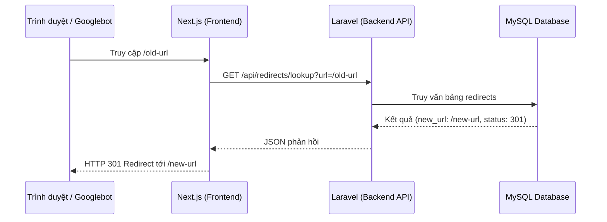

# Thiết kế Hệ thống 301 Redirect Tự động & Thủ công cho Ford Đồng Nai

Tài liệu này đặc tả thiết kế kỹ thuật cho tính năng quản lý chuyển hướng 301 (301 Redirect) nhằm tối ưu hóa SEO khi thay đổi Slug nội dung (bài viết, dòng xe) hoặc chuyển hướng từ các liên kết cũ về liên kết mới.

## 1. Hiện trạng & Tính khả thi

*   **Database**: Đã có sẵn bảng `redirects` với các trường `old_url`, `new_url`, `status_code`, `is_active`.
*   **Model**: Đã có model `JamstackVietnam\Redirect\Models\Redirect` hỗ trợ truy vấn chuyển hướng.
*   **Frontend (Next.js)**: Chưa có cơ chế đón và thực thi chuyển hướng động từ Database của CMS, chỉ có các cấu hình chuyển hướng tĩnh ở `next.config.ts`.

---

## 2. Kiến trúc & Giải pháp đề xuất

Giải pháp bao gồm sự phối hợp giữa Backend Laravel và Frontend Next.js:

### 2.1. Backend Laravel (API & Business Logic)

#### A. API Tra cứu Chuyển hướng
*   **Endpoint**: `GET /api/redirects/lookup`
*   **Tham số**: `url` (đầy đủ hoặc tương đối).
*   **Logic**:
    1. Parse URL lấy phần path tương đối (ví dụ: `tin-tuc/everest-2025-cu`).
    2. Truy vấn bảng `redirects` tìm bản ghi đang kích hoạt (`is_active = 1`).
    3. Nếu tìm thấy, trả về URL đích (`new_url`) và mã trạng thái (`status_code`).

#### B. Tự động hóa Observer (Auto Redirect on Slug Change)
*   Tạo Observer hoặc lắng nghe sự kiện `updating` trên các Model Translation:
    *   `App\Models\Post\PostTranslation`
    *   `App\Models\Vehicle\VehicleTranslation`
*   **Logic**:
    1. Khi `slug` hoặc `seo_slug` thay đổi, xác định URL tương đối cũ và mới dựa trên loại nội dung:
        *   Đối với Post (bài viết): `tin-tuc/old-slug` (Tiếng Việt) hoặc `posts/old-slug` (Tiếng Anh).
        *   Đối với Service (dịch vụ): `dich-vu/old-slug` hoặc `services/old-slug`.
        *   Đối với Vehicle (dòng xe): `old-slug` hoặc `en/old-slug`.
    2. Ghi nhận một bản ghi chuyển hướng `301` từ URL cũ sang URL mới vào bảng `redirects`.

#### C. Quản lý Thủ công trong Form soạn thảo (Inertia CMS Form)
*   Thêm một trường Textarea vào Form biên tập bài viết và dòng xe: **"Đường dẫn 301 Redirect"**.
*   Trường này cho phép nhập danh sách URL cũ (mỗi dòng một URL) cần chuyển về bài viết/sản phẩm hiện tại.
*   **Khi load form**: Lấy danh sách các redirect có `new_url` khớp với URL hiện tại của item hiển thị lên Textarea.
*   **Khi lưu form (afterStore)**:
    1. Đọc danh sách URL cũ từ Textarea.
    2. Cập nhật bảng `redirects` (thêm mới hoặc cập nhật đích đến về URL hiện tại).
    3. Tự động xóa các bản ghi redirect cũ liên kết với bài viết này nếu chúng không còn nằm trong danh sách nhập mới.

---

### 2.2. Frontend Next.js (Middleware)

*   **Tạo file**: `fe/src/middleware.ts`
*   **Chức năng**:
    1. Chặn mọi yêu cầu truy cập từ Client (loại trừ các thư mục tĩnh như `_next`, `static`, `api`, v.v.).
    2. Gửi request gọi API `GET /api/redirects/lookup?url={pathname}` tới Laravel.
    3. Nếu API trả về thông tin chuyển hướng, Next.js thực hiện `NextResponse.redirect(newUrl, statusCode)`.
    4. Nếu không, tiếp tục luồng xử lý proxy hiện tại ở [proxy.ts](file:///d:/git/bed-dongnaiford/fe/src/proxy.ts).

---

## 3. Kịch bản Xác minh (Verification Plan)

### Kiểm tra tự động (Automated tests)
*   Viết test case kiểm tra việc cập nhật slug bài viết sẽ tự động sinh bản ghi trong bảng `redirects`.
*   Viết test API `redirects/lookup` đảm bảo trả về đúng URL đích đã định cấu hình.

### Kiểm tra thủ công (Manual Verification)
1.  Truy cập trang sửa bài viết, nhập 3 URL cũ khác nhau vào ô Redirect.
2.  Lưu bài viết.
3.  Kiểm tra trong database bảng `redirects` xem đã lưu đủ 3 bản ghi trỏ về cùng 1 link bài viết chưa.
4.  Dùng trình duyệt truy cập 3 URL cũ đó trên cổng `3000` (Next.js) và xác minh trình duyệt chuyển hướng đúng về link bài viết mới với mã trạng thái `301`.
